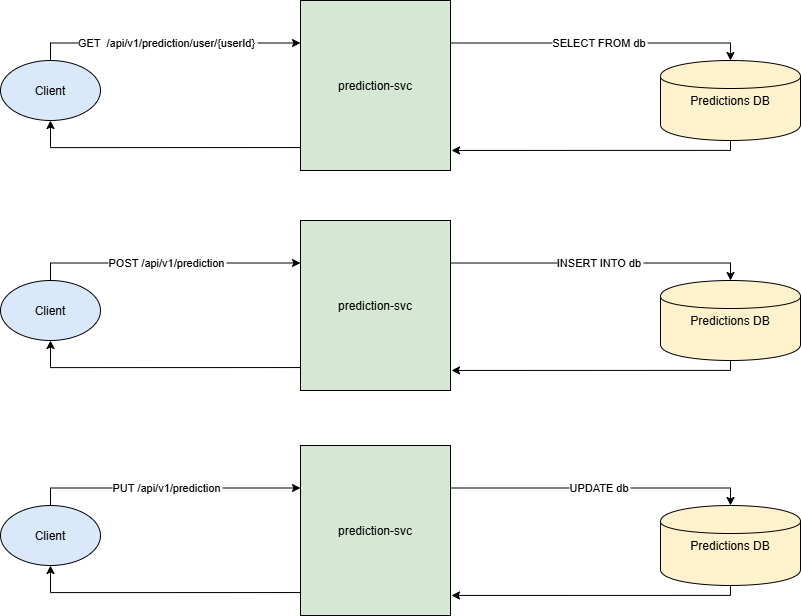
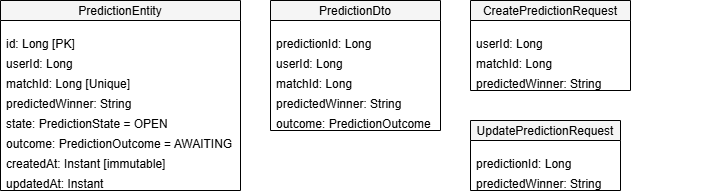

# 🏆 Prediction Service

A minimal, cleanly designed REST API for creating and managing user match predictions.

---

## ⚙️ Tech Stack

- **Java 21**
- **Spring Boot 3**
- **Docker**
- **PostgreSQL 16** (Dockerized)
- **Maven** – for project build and dependency management

---

## 📌 Assumptions & Design Decisions

- Assumes **User** and **Match** entities already exist and are managed externally.
- Assumes there is an API Gateway in place, and users interact with the service through the gateway, not directly.
- Focused on a clean, minimal REST API architecture using Spring Boot and PostgreSQL.
- DTOs use JSR-380 annotations (`@NotNull`, etc.) for simple validation.
---

## 🔁 Improvements (with More Time)

- 🔐 **Authentication & Authorization**  
  Introduce JWT-based security so that all requests go through a filter to validate and authorize based on token claims.

- ⚠️ **Global Exception Handling**  
  Implement custom exception classes and a `@ControllerAdvice`-based handler to return consistent, well-structured error responses.

- 🛠️ **Flyway for DB Migrations**  
  Add Flyway support for managing schema migrations over time, which would help version the database cleanly and safely.

- 📘 **API Documentation with Swagger/OpenAPI**  
  Would add auto-generated documentation using SpringDoc OpenAPI or Swagger UI to provide a browsable and testable interface for the API. This would make it easy for developers to explore endpoints, models, and expected inputs/outputs.

- 📊 Pagination Support Implement pagination for list endpoints (e.g., predictions) using Spring Data’s Pageable interface. This ensures better performance and scalability, especially when dealing with large datasets.

- ⚡ Rate Limiting
  Implement rate limiting to protect the API from abuse and ensure fair usage. This would restrict the number of requests a user can make within a certain time period, preventing overload and safeguarding system resources.

- 🗂️ HTTP Caching
  Implement caching of predictions to improve performance. When requests for user predictions are made, the service could check if the data is already cached and return it instead of querying the database again. This would reduce load times and database hits.
---


🖼️ Diagrams
This section includes the essential diagrams for understanding the architecture, sequence of interactions, and database entities for the Prediction Service.

Sequence Diagram



Entity Diagram



---

## 🚀 Running the App Locally (with Docker)

The project includes a `docker-compose.yml` file that sets up the entire environment, including:

- PostgreSQL database
- pgAdmin for database management
- Prediction service

### ▶️ Start the App

```bash
docker-compose up --build
```

### ▶️ Stop the App

```bash
docker-compose down
```